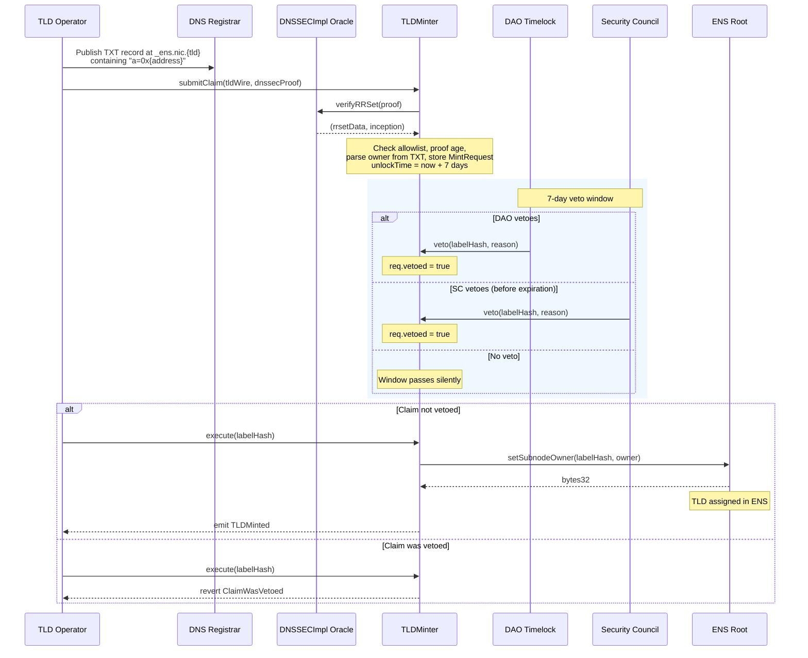

# TLD Oracle v2 — Proposal Rationale

## What this proposal is asking the DAO to do

This proposal asks ENS DAO to deploy a smart contract called TLDMinter and authorize it as a controller of the ENS Root. Once authorized, TLDMinter allows ICANN-registered top-level domain operators to claim their TLD as an ENS name — trustlessly, on-chain, without requiring manual intervention from ENS Labs.

The mechanism: a TLD operator publishes a DNSSEC-signed TXT record at `_ens.nic.{tld}` pointing to their Ethereum address. TLDMinter reads that cryptographic proof on-chain via the existing DNSSECImpl oracle, verifies it, and if the TLD is on the DAO-approved allowlist, opens a 7-day claim window. The DAO or Security Council can veto during that window. If no veto, the TLD is assigned.

The initial allowlist covers 1,166 post-2012 ICANN gTLDs — the full set of generic TLDs delegated since the 2012 expansion round. Pre-2012 TLDs and `.eth` are explicitly excluded. `.eth` is permanently locked at the Root contract level — `Root.locked["eth"] = true` — meaning even if `.eth` were somehow added to the allowlist, any attempt by TLDMinter to call `setSubnodeOwner` for it would revert at the Root. The protection is enforced by the Root contract, not by TLDMinter itself.

---

## Proposal structure

Seeding 1,166 TLDs into the allowlist requires 1,166 SSTORE operations. Each SSTORE costs 20,000 gas. That's 23.3M gas at the floor, before deployment overhead.

The full proposal — deploying TLDMinter, authorizing it, and seeding all 1,166 TLDs — costs approximately 30.7M gas. Ethereum's block gas limit is currently 60M (raised from 30M in early 2025), so the entire proposal fits comfortably within a single block with ~48% headroom.

The proposal executes 6 calls through the DAO timelock:

1. **CREATE2 deploy** (~2.0M gas) — deploy TLDMinter at a deterministic address via the CREATE2 factory
2. **setController** (~25K gas) — authorize TLDMinter as a Root controller
3. **batchAddToAllowlist** (~7.4M gas) — seed TLDs 1–300
4. **batchAddToAllowlist** (~7.4M gas) — seed TLDs 301–600
5. **batchAddToAllowlist** (~7.4M gas) — seed TLDs 601–900
6. **batchAddToAllowlist** (~6.5M gas) — seed TLDs 901–1,166

Total governance time: ~9 days (one 7-day voting period + one 2-day timelock).

---

## Rate limiting

TLDMinter enforces a rate limit on claim execution: a maximum of 10 TLD claims per 7-day rolling window. This is set at deploy time via constructor arguments and is enforced in `submitClaim()`.

The DAO can adjust these parameters post-deployment via `setRateLimit()`, which is `onlyDAO`. The rate limit is a safety valve — it bounds the blast radius if a bad actor somehow obtained a valid DNSSEC proof for a non-intended TLD before the DAO could veto.

---

## Emergency pause

Both `pause()` and `unpause()` are gated by `onlyVetoAuthority` — accessible by the DAO Timelock or the Security Council Multisig while the SC is active. After the Security Council's mandate expires (July 24, 2026), only the DAO Timelock can pause or unpause TLDMinter. This is intentional: emergency response transitions from the SC to full DAO governance as the protocol matures.

---

## Veto authority — how it works

The DAO Timelock and Security Council do not need to be called, registered, or notified as part of this proposal. Their authority is established purely at deploy time: TLDMinter's constructor accepts both addresses as immutable arguments and stores them on-chain. After that, `veto()`, `pause()`, and `unpause()` simply check `msg.sender` against those stored addresses.

This means the DAO Timelock is involved in this proposal in exactly one capacity: as the **executor** of the 6 calls. It is not a target of any call. The Security Council has veto power from the moment TLDMinter is deployed — no follow-up transaction required.

The full post-deployment claim flow, from operator to TLD assignment:



The veto authority check in code:

```solidity
modifier onlyVetoAuthority() {
    bool isDAO = (msg.sender == daoTimelock);
    bool isSC  = (
        msg.sender == securityCouncilMultisig &&
        !_securityCouncilVetoRevoked &&
        block.timestamp < securityCouncil.expiration()
    );
    if (!isDAO && !isSC) revert NotVetoAuthority(msg.sender);
    _;
}
```

After July 24, 2026, `securityCouncil.expiration()` returns a timestamp in the past, permanently disabling the SC branch. Only `isDAO` remains valid.

This logic is covered by `ClaimSimulation.t.sol` in the repository, which tests all four paths: happy path, DAO veto, SC veto, and premature execution.

---

## The question for delegates

The single-proposal structure is technically complete, fully tested, and ready to submit. All 1,166 TLDs are seeded in one governance cycle (~9 days), with no sequencing dependencies or follow-up proposals required.
