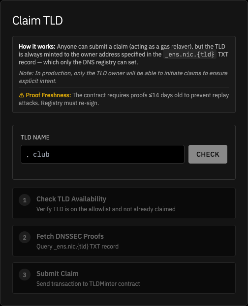
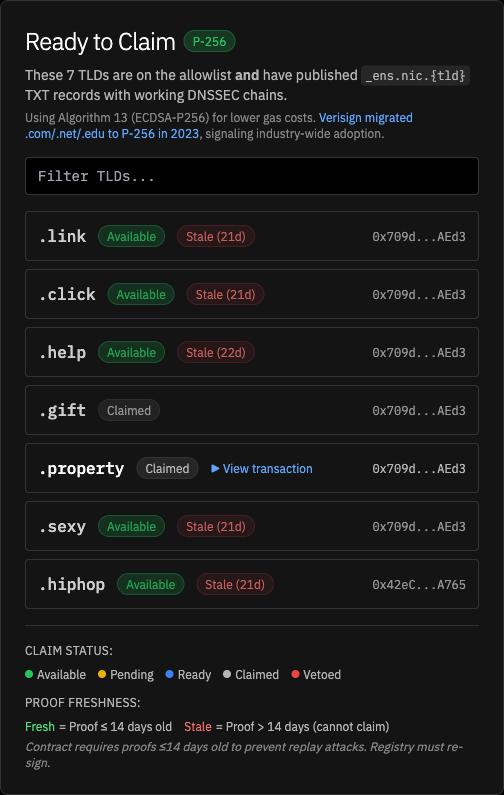
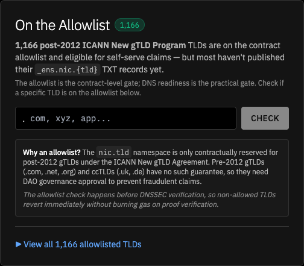
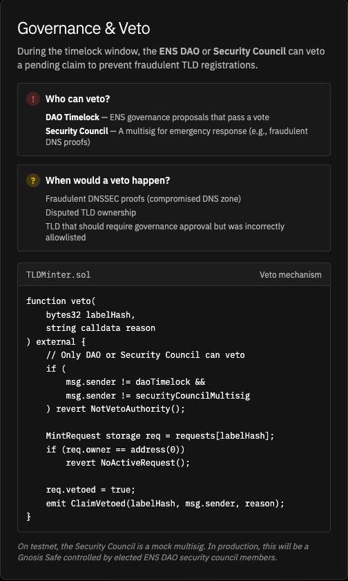
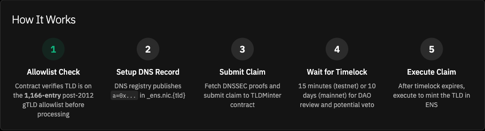

# [Temp Check] DNS-Verified TLD Fast-Path (Steg) — programmable gTLD assignment with 7-day veto
<!-- draft-version: 2 -->

## TL;DR

- **What:** Authorize TLDMinter v2 as an ENS Root controller and seed 1,166 post-2012 ICANN gTLDs into its allowlist — in a single executable proposal.
- **Why:** DNS proposes, ENS programmatically executes under DAO-defined law. TLD operators claim their names trustlessly via DNSSEC proofs, with a 7-day veto window for the DAO and Security Council.
- **Receipt:** Sepolia testnet — DNSSEC proof verified via [`submitClaim`](https://sepolia.etherscan.io/tx/0xe76d7ded41fd286cbfded251bebcf2ca8c5db1e18e5baccd15d701a82323e785), TLD minted via [`execute`](https://sepolia.etherscan.io/tx/0x99998721d5e108f11c8e695e0543e5c2473f09d2fe6a04005dd51e4d329e9ec9). Contract: [`0x48729B...980F`](https://sepolia.etherscan.io/address/0x48729B7e0bA736123a57c4B6A492BDAbedAF980F)
- **Policy:** 7-day veto window, 10 claims per 7-day rolling window, 14-day proof freshness, emergency pause.
- **Ask:** Signal support for this design going to audit + executable. Estimated audit budget: $30k-$50k.

---

## Problem

ENS can recognize top-level domains from the traditional DNS system (like `.xyz`, `.app`, `.club`), but adding each one is a manual process. Today, bringing a single TLD into ENS requires someone to write a governance proposal, submit it to the DAO, wait for delegates to vote on it (7 days), wait for the timelock to clear (2 days), and then the DAO's timelock executes a single transaction that registers that TLD in the ENS Registry. One TLD, one proposal, ~9 days.

There are roughly 1,500 ICANN TLDs, and a new gTLD application round is approaching. Asking delegates to vote on each one individually doesn't scale — it would consume governance bandwidth for years on what is essentially a repetitive, mechanical process.

At the same time, DNS can't become an authority over ENS. The DAO must retain the ability to approve, reject, or revoke any TLD assignment. The question is whether we can make the *process* programmable without giving up that sovereignty.

DNS can become *evidence* that ENS acts on programmatically — under rules the DAO defines and can change at any time. This follows Article V of the ENS Constitution, which commits ENS to integrating with the global DNS namespace while preserving decentralization.

---

## Proposed Solution

TLDMinter v2 is a smart contract that lets ICANN TLD operators claim their TLD in ENS by proving DNS ownership on-chain. The system enforces strict separation across five layers:

| Layer | Contract | Responsibility |
|-------|----------|----------------|
| **DNS Verification** | `DNSSECImpl` | Verifies DNSSEC cryptographic chains, returns authenticated DNS records |
| **Policy Enforcement** | `TLDMinter` | Parses `_ens.nic.{tld}` TXT records, enforces DAO policy (timelock, rate limits, veto), calls Root |
| **Veto Authority** | DAO Timelock / Security Council | Can veto pending claims during 7-day window |
| **Root Authority** | `ENS Root` | Gatekeeper — only authorized controllers can write TLDs to the Registry |
| **State Storage** | `ENS Registry` | Canonical ownership state |

### Execution flow

```
    submitClaim() ──► DNSSECOracle.verifyRRSet()
                          │
                          ▼
                  TLDMinter stores pending request
                          │
                          ▼
                ┌─────────────────────┐
                │  MINIMUM 7-DAY WAIT │◄─── veto() by DAO or Security Council
                │  (veto open until   │     (can veto any time before execute)
                │   execute() called) │
                └─────────────────────┘
                          │
                          ▼ (if not vetoed)
      execute() ──► Root.setSubnodeOwner()
                          │
                          ▼
                  Registry.setSubnodeOwner(0x0, label, owner)
                          │
                          ▼
                  Ownership recorded ✓
```

### Allowlist

Only **1,166 post-2012 ICANN New gTLD Program** TLDs are eligible for self-serve claims. Pre-2012 gTLDs (`.com`, `.net`, `.org`) and ccTLDs (`.uk`, `.de`) are excluded — the `nic.tld` namespace is only contractually reserved for post-2012 gTLDs under the ICANN New gTLD Agreement, so pre-2012 TLDs need a full governance proposal.

`.eth` is permanently locked at the Root contract level — `Root.locked["eth"] = true` — so even if `.eth` were somehow added to the allowlist, any attempt to assign it would revert. This protection is enforced by the Root, not by TLDMinter.

### Policy parameters

| Parameter | Value | Adjustable? |
|-----------|-------|-------------|
| Minimum delay before execution | 7 days | By DAO (constructor arg) |
| Rate limit | 10 claims per 7-day window | By DAO (`setRateLimit()`) |
| Proof freshness | 14 days max age | By DAO (constructor arg) |
| Emergency pause | `pause()` / `unpause()` | DAO Timelock or Security Council |
| Security Council veto | Active until July 24, 2026 | Expires automatically; DAO retains permanent veto |

---

## Proposal structure

TLDMinter is pre-deployed via EOA and verified on Etherscan before the vote, following the standard ENS governance pattern (precedent: Blockful's RegistrarManager, audited by Cyfrin). Delegates can inspect the deployed contract during the entire voting period.

Single proposal, 5 calls through the DAO timelock (~29.1M gas, ~51% headroom vs 60M block limit):

| Call | Target | Action | Gas |
|------|--------|--------|----:|
| 1 | Root | `setController(tldMinter, true)` | 27,809 |
| 2 | TLDMinter | `batchAddToAllowlist(TLDs 1-300)` | 7,473,523 |
| 3 | TLDMinter | `batchAddToAllowlist(TLDs 301-600)` | 7,484,020 |
| 4 | TLDMinter | `batchAddToAllowlist(TLDs 601-900)` | 7,494,509 |
| 5 | TLDMinter | `batchAddToAllowlist(TLDs 901-1,166)` | 6,653,469 |
| | | **Total** | **29,133,330** |

Total governance time: ~9 days (7-day voting period + 2-day timelock). All 1,166 TLDs seeded in one cycle.

---

## TLD Oracle v2 Portal Walkthrough

Live demo: [dnssec.eketc.co/tld-oracle](https://dnssec.eketc.co/tld-oracle)
Sepolia: [`submitClaim`](https://sepolia.etherscan.io/tx/0xe76d7ded41fd286cbfded251bebcf2ca8c5db1e18e5baccd15d701a82323e785) | [`execute`](https://sepolia.etherscan.io/tx/0x99998721d5e108f11c8e695e0543e5c2473f09d2fe6a04005dd51e4d329e9ec9) | [Contract](https://sepolia.etherscan.io/address/0x48729B7e0bA736123a57c4B6A492BDAbedAF980F)

---

### 1. Claim TLD



The claim interface is a 3-step process. Anyone can submit a claim (acting as a gas relayer), but the TLD is always minted to the owner address in the `_ens.nic.{tld}` TXT record -- which only the DNS registry operator can set. The contract enforces a 14-day proof freshness window to prevent replay attacks: if a DNSSEC proof is older than 14 days, the registry must re-sign before a claim can proceed.

---

### 2. Ready to Claim



These are the 7 TLDs that are both on the allowlist and have published working DNSSEC chains with `_ens.nic.{tld}` TXT records. The "Stale" badges show the proof freshness system in action -- these proofs are older than 14 days, so claims would revert until the registry re-signs. Two TLDs (.gift, .property) have already been claimed on the Sepolia testnet. The proof freshness check uses Algorithm 13 (ECDSA-P256), which Verisign adopted for .com/.net/.edu in 2023, signaling industry readiness.

---

### 3. On the Allowlist



The contract-level gate: 1,166 post-2012 ICANN New gTLD Program TLDs are eligible for self-serve claims. Pre-2012 gTLDs (.com, .net, .org) and ccTLDs (.uk, .de) are excluded because the `nic.tld` namespace is only contractually reserved for post-2012 gTLDs under the ICANN New gTLD Agreement. Any TLD not on the allowlist reverts immediately without burning gas on DNSSEC proof verification. Delegates can check any TLD against the allowlist using the input field.

---

### 4. Governance and Veto



The safety mechanism. Either the ENS DAO or the Security Council can veto any pending claim at any point before `execute()` is called — the 7-day timelock is the minimum delay, but the veto window remains open until execution. The veto function checks `msg.sender` against the stored DAO timelock and Security Council multisig addresses. Veto scenarios include fraudulent DNSSEC proofs, disputed TLD ownership, or incorrectly allowlisted TLDs. After the Security Council's mandate expires (July 24, 2026), only the DAO retains veto authority.

---

## 5. How It Works



The end-to-end flow in 5 steps: (1) Contract verifies the TLD is on the 1,166-entry allowlist, (2) DNS registry publishes an `a=0x...` record at `_ens.nic.{tld}`, (3) Claim is submitted with DNSSEC proofs to TLDMinter, (4) 7-day timelock window for DAO/Security Council review, (5) After timelock expires with no veto, anyone can execute to mint the TLD in ENS. The entire flow is trustless -- no manual intervention from ENS Labs required.

---

## Testing

The proposal has been tested end-to-end against a mainnet fork using the full ENS governance pipeline (propose, vote, queue, execute through the real Governor and Timelock contracts):

```bash
git clone https://github.com/steg-eth/dao-proposals.git
cd dao-proposals
cp .env.example .env && echo "MAINNET_RPC_URL=https://eth.drpc.org" >> .env
forge test --match-path "src/ens/proposals/tld-oracle-v2/*" --fork-url $MAINNET_RPC_URL -vv
```

5 tests pass:
- `test_proposal()` — full governance lifecycle with before/after state assertions
- `test_fullClaimLifecycle()` — submit claim, wait 7 days, execute
- `test_daoVetoBlocksClaim()` — DAO vetoes, execute reverts
- `test_securityCouncilVetoBlocksClaim()` — SC vetoes, execute reverts
- `test_cannotExecuteBeforeWindowExpires()` — premature execution reverts

---

## Decisions in this Temp Check

1. **Do you support the single-proposal structure?** TLDMinter pre-deployed via EOA, proposal authorizes it and seeds the full allowlist in one vote.

2. **Are you comfortable with the veto + rate-limit policy?** 7-day minimum delay (veto open until execution), 10 claims per rolling 7-day window, Security Council veto active until July 2026.

3. **Do you support allocating audit budget?** Estimated $30k-$50k for a security audit before the executable goes on-chain.

---

## Artifacts

- **RFC:** [Scaling TLD assignment with DNS-verified DAO-governed allocation](https://discuss.ens.domains/t/rfc-a-programmable-fast-path-for-tld-assignment/21859)
- **Repo:** [steg-eth/dao-proposals](https://github.com/steg-eth/dao-proposals) — `src/ens/proposals/tld-oracle-v2/`
- **Rationale:** [RATIONALE.md](https://github.com/steg-eth/dao-proposals/blob/main/src/ens/proposals/tld-oracle-v2/RATIONALE.md)
- **Demo:** [dnssec.eketc.co/tld-oracle](https://dnssec.eketc.co/tld-oracle)
- **Gas breakdown:** [gas-table.md](https://github.com/steg-eth/dao-proposals/blob/main/src/ens/proposals/tld-oracle-v2/gas-table.md)

---

## Next steps

If this Temp Check passes:
1. Finalize audit scope and assign firm.
2. Prep the executable proposal with audited contract address.
3. File Snapshot (if required) and move to on-chain governance.
